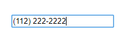

# Welcome to chalo-phone-format!

> Hi! It's a React component to build a customized UI of
> https://www.npmjs.com/package/react-number-format.
>
> It's too a input phone for React.
>
> **Install-package**
>
> - npm install chalo-phone-format
> - yarn add chalo-phone-format

## What does it?



- You can define your own format.
- You can define your own mask.

## How to implated it?

You can see the example complete in directory **src/example/ExampleImplementation.js**

```JavaScript
    // src/example/ExampleImplementation.js
    ...
    //It's a method to change the value in Phone
    handleChange(value) {
        console.log(value);
    }

    render () {
        return (<div className="container">
          <Phone
            //(Optional) It's the value by default
            value={"2151234455"}
            handleChange={this.handleChange}
            //(Optional) It wil add a field more in respuest
            //formatOK:true --> meets the format
            //formatOK:false --> not meets the format
            isFormatOK={true}
            //(Optional) you can define your own format.
            //** It's mandatory to use the # character to represent the numbers.
            //format="(###) ###-####"
            //(Optional) You can define your own mask
            //mask="-"
           />
        </div>)
    }
    }
```
